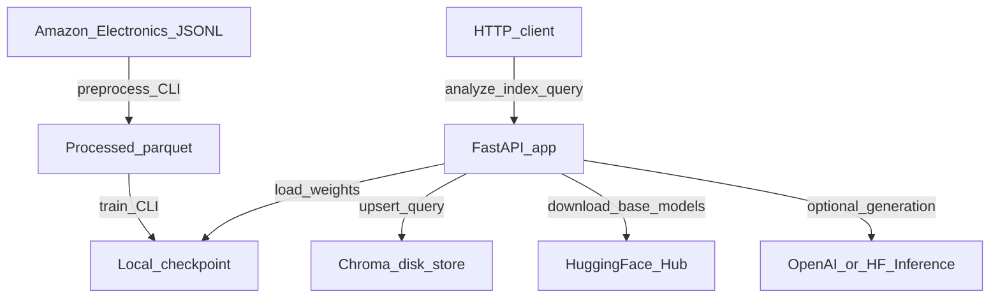
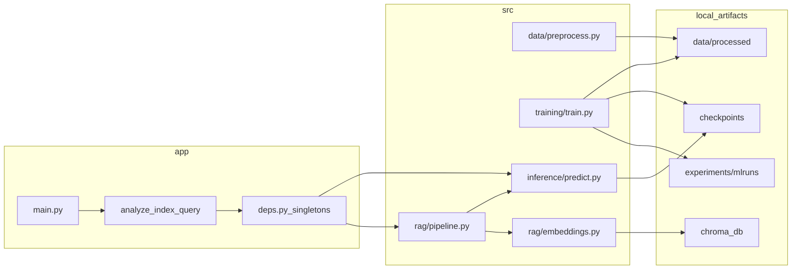
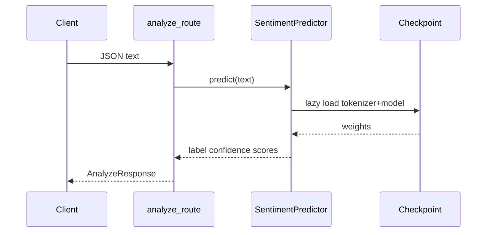

# Architecture

## System context

## Component view

## Offline vs online

| Path | Entry | Writes | Reads |
|------|-------|--------|-------|
| Preprocess | `python -m src.data.preprocess` | `data/processed/*.parquet` | Amazon JSONL URL |
| Train | `python -m src.training.train` | `checkpoints/*/best-model`, MLflow | parquet |
| Serve | `uvicorn app.main:app` | `chroma_db/` on index | checkpoint + Chroma |
| Colab | `notebooks/colab_train.ipynb` | remote checkpoint zip | parquet or re-stream |

## Runtime request flows

### Sentiment (`POST /api/analyze`)

### Index (`POST /api/index`)

1. Validate 1–500 reviews.
2. For each review: DistilBERT sentiment prediction.
3. Embed texts with MiniLM; upsert into Chroma with metadata (`sentiment`, `rating`, `product_id`, `review_id`).
4. Return indexed rows + collection size.

### Query (`POST /api/query`)

1. Embed question; retrieve top-k from Chroma (optional `sentiment` filter).
2. If no hits → empty-collection extractive message.
3. Else generation mode priority:
   - `OPENAI_API_KEY` set → OpenAI Chat Completions
   - else `HF_API_KEY` set → Hugging Face Inference API
   - else **extractive** bullet summary of retrieved snippets

## Design patterns in this codebase

### Singleton DI (lazy)

[`app/api/deps.py`](../app/api/deps.py) caches one `SentimentPredictor` and one `RagPipeline` on the dependency functions. Models load on **first request**, not at process start (no FastAPI lifespan warmup).

### Shared settings

[`app/core/config.py`](../app/core/config.py) uses pydantic-settings. Offline CLIs (`preprocess`, `train`) and online ML modules import `get_settings()` — the ML layer currently depends on the API config module.

### Checkpoint resolution

`Settings.resolved_model_path` tries, in order:

1. `MODEL_PATH` from env / settings
2. `./checkpoints/best-model`
3. `./checkpoints/week3-distilbert/best-model`
4. `./checkpoints/week2-distilbert/best-model`

### Persistence boundaries

| Store | Location | Shared? |
|-------|----------|---------|
| Model weights | `checkpoints/` | Local disk; gitignored |
| Vectors | `chroma_db/` | Local PersistentClient (not Chroma server) |
| Experiments | `experiments/mlruns/` | Local MLflow file store |
| Processed data | `data/processed/` | Local + optional DVC |

## External boundaries

- **Inbound:** unauthenticated HTTP (dev assumption).
- **Outbound:** Hugging Face Hub (base models / embeddings), optional OpenAI or HF Inference for generation, Amazon JSONL URL during preprocess.
- **Secrets:** `OPENAI_API_KEY`, `HF_API_KEY` stay server-side in `.env` (gitignored).

## Placeholders (not active architecture)

| Path | Status |
|------|--------|
| [`app/ml/loader.py`](../app/ml/loader.py) | Empty — singleton loading lives in `deps.py` |
| [`docker/Dockerfile`](../docker/Dockerfile) | Empty — no containerized deploy yet |

Next: [CODEBASE_GUIDE.md](CODEBASE_GUIDE.md).
