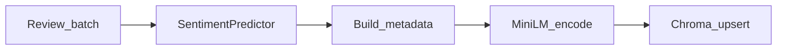

# RAG

Retrieval-Augmented Generation over product reviews: **classify → embed → store → retrieve → answer**.

Core modules:

- [`src/rag/embeddings.py`](../src/rag/embeddings.py) — MiniLM + Chroma
- [`src/rag/pipeline.py`](../src/rag/pipeline.py) — orchestration + LLM backends
- Routes: [`app/api/routes/index.py`](../app/api/routes/index.py), [`query.py`](../app/api/routes/query.py)

## Why sentiment-aware indexing?

Each review is labeled with DistilBERT **before** embedding. Sentiment becomes Chroma metadata so queries can filter, e.g. only `negative` reviews.

## Indexing path (`POST /api/index`)



Per review input fields:

| Field | Required | Notes |
|-------|----------|-------|
| `text` | yes | Non-empty |
| `review_id` | no | UUID generated if omitted |
| `rating` | no | 1–5 at API validation |
| `product_id` | no | Stored as string metadata |

Batch limits at API: **1–500** reviews per request.

Chroma metadata keys (consistent across rows): `sentiment`, `rating` (missing → sentinel **`-1.0`**), `product_id`.  
Collection default name: `product_reviews` (`RAG_COLLECTION`). Space: **cosine** HNSW. Persist path: `CHROMA_PATH` (default `./chroma_db`).

Embedding model default: `sentence-transformers/all-MiniLM-L6-v2` (`EMBEDDING_MODEL`). Loaded lazily on first encode (~90MB download once).

## Query path (`POST /api/query`)

1. Encode `question`
2. `collection.query` with `n_results` (default `RAG_TOP_K`, API allows 1–20)
3. Optional `where={"sentiment": "<filter>"}` when `sentiment_filter` is `negative|neutral|positive`
4. Generate answer from retrieved documents

### Answer mode priority

| Priority | Condition | `mode` value |
|----------|-----------|--------------|
| 1 | `OPENAI_API_KEY` non-empty | `openai` |
| 2 | else `HF_API_KEY` non-empty | `huggingface` |
| 3 | else | `extractive` |

Extractive mode needs **no** LLM download: it formats retrieved snippets into a readable answer and returns `sources`.

LLM calls use `urllib` HTTPS from the API process (keys never sent to the client). Failures typically surface as HTTP **502**.

## Response shape (conceptual)

```json
{
  "status": "ok",
  "answer": "...",
  "mode": "extractive",
  "question": "...",
  "sentiment_filter": "negative",
  "sources": [
    {
      "text": "...",
      "sentiment": "negative",
      "rating": 1.0,
      "product_id": "...",
      "review_id": "...",
      "distance": 0.42
    }
  ]
}
```

Exact source fields follow `RetrievedReview` / pipeline serialization.

## Grounding limitations

- Answers depend only on **indexed** reviews, not the full Amazon corpus or parquet splits.
- Extractive mode cannot synthesize beyond snippets.
- LLM modes can still hallucinate; prompt instructs “based on reviews,” but there is no citation-enforcing verifier.
- Bad sentiment model → wrong filters / skewed metadata.
- Empty collection → graceful extractive message, not a crash.
- Rating sentinel `-1.0` means “unknown,” not a one-star review.

## Operational tips

- Rebuild index after swapping to a better sentiment checkpoint if you care about metadata quality.
- Delete or move `chroma_db/` to reset the collection (dev only).
- Keep batch sizes modest on CPU (encode batch default 64 inside the store).

Next: [API.md](API.md).
