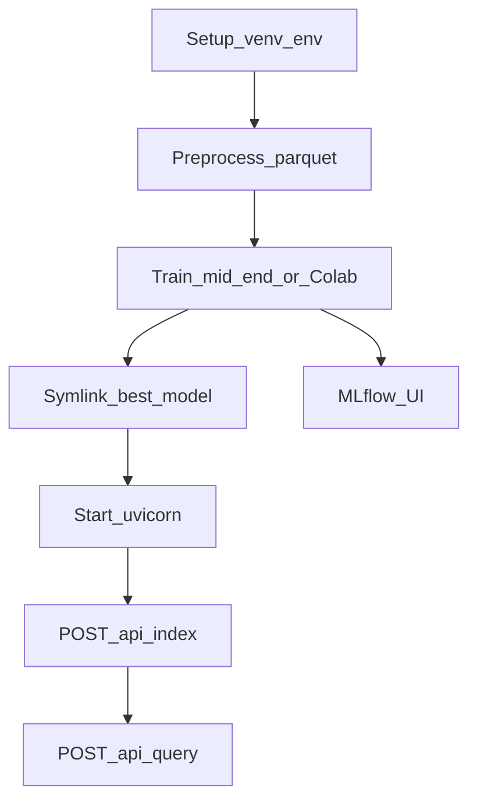

# Workflows

All Python commands assume:

```bash
cd /path/to/ML
source venv/bin/activate
```

## 1. First-time setup

1. Create venv at repo root: `python3 -m venv venv`
2. Install Torch (CPU or GPU) then `pip install -r requirements.txt` — see [INSTALL.md](../INSTALL.md)
3. `cp -n .env.example .env`
4. Ensure a checkpoint exists under `checkpoints/` (train locally or import from Colab)

## 2. Build processed data

```bash
python -m src.data.preprocess --max-samples 50000 --output-dir data/processed
```

Outputs: `train.parquet`, `validation.parquet`, `test.parquet`.

Optional DVC (from **repo root**):

```bash
cd /path/to/ML
dvc add data/processed/train.parquet
dvc add data/processed/validation.parquet
dvc add data/processed/test.parquet
git add data/processed/*.dvc .gitignore
```

Details: [DATA.md](DATA.md), [DVC.md](../DVC.md).

## 3A. Local smoke training (CPU)

```bash
python -m src.training.train \
  --profile mid-end \
  --data-dir data/processed \
  --output-dir checkpoints/week3-distilbert
```

`mid-end` defaults: 2 epochs, max 2000 train / 400 val / 400 test samples.

Point the API at the result:

```bash
ln -sfn week3-distilbert/best-model checkpoints/best-model
```

## 3B. Colab / GPU production train

1. Open `notebooks/colab_train.ipynb` with a GPU runtime.
2. Upload parquet **or** re-stream Amazon data in the notebook.
3. Train to `/content/checkpoints/production-distilbert/best-model`.
4. Follow [COLAB_EXPORT.md](../notebooks/COLAB_EXPORT.md) to unzip and symlink on this machine.

## 4. Start the API

```bash
uvicorn app.main:app --reload --host 0.0.0.0 --port 8000
```

Verify:

```bash
curl http://127.0.0.1:8000/health
```

First `/api/analyze` or `/api/index` loads the DistilBERT checkpoint (cold start). First embed downloads MiniLM if not cached.

## 5. Index reviews then query

```bash
curl -X POST http://127.0.0.1:8000/api/index \
  -H 'Content-Type: application/json' \
  -d '{"reviews":[{"text":"Battery lasts two days","rating":5,"product_id":"B00EXAMPLE"},{"text":"Screen cracked in a week","rating":1}]}'

curl -X POST http://127.0.0.1:8000/api/query \
  -H 'Content-Type: application/json' \
  -d '{"question":"What do customers complain about?","sentiment_filter":"negative","n_results":5}'
```

RAG modes: [RAG.md](RAG.md).

## 6. Inspect experiments

```bash
mlflow ui --backend-store-uri ./experiments/mlruns --host 0.0.0.0 --port 5000
```

Open http://127.0.0.1:5000 — experiment name `review-intelligence-week3` for local `train.py`.

## 7. Run tests

```bash
python -m pytest -q
```

## End-to-end diagram



## Promotion checklist (model)

- [ ] Test metrics reviewed (target F1 macro ≥ 0.90 at full scale)
- [ ] `best-model/` contains `config.json`, `model.safetensors`, tokenizer files
- [ ] `checkpoints/best-model` symlink or `MODEL_PATH` updated
- [ ] Smoke: `python -c "from src.inference.predict import predict_text; print(predict_text('Battery life is excellent'))"`
- [ ] Restart uvicorn after swapping weights (singleton already loaded otherwise)

Next: [DATA.md](DATA.md).
